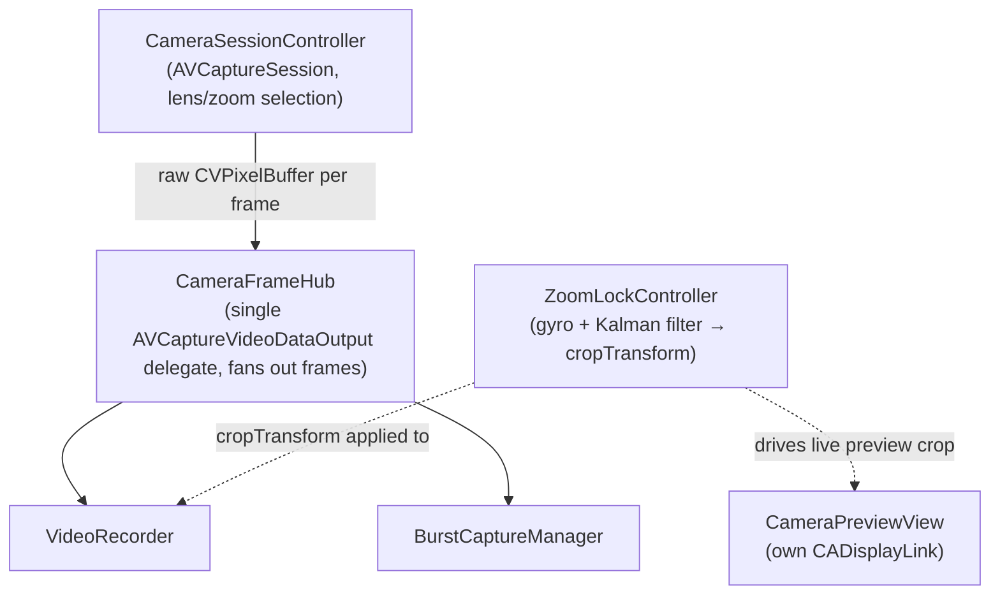
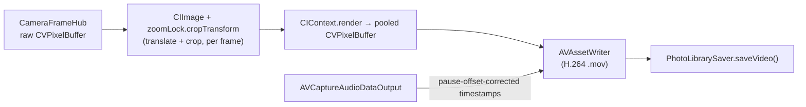

# Camera Pipeline Overview

A map of what the code actually does today, end to end, split by photo vs. video. This is a reference snapshot, not a research log — see [CAMERA_RESEARCH.md](CAMERA_RESEARCH.md) for the dated decision history and open investigations behind these choices. Update this file when the pipeline shape changes; keep the "why we built it this way" narrative in CAMERA_RESEARCH.md.

## 1. Shared foundation

Both photo and video start from the same capture layer before diverging.

- **`CameraSessionController`** owns the `AVCaptureSession` and picks the device: prefers `.builtInTripleCamera` (virtual multi-lens device) so a single `videoZoomFactor` drives lens switching (ultra-wide → wide → telephoto) and digital zoom past that, the same mechanism the native Camera app uses.
- **`CameraFrameHub`** is the single `AVCaptureVideoDataOutput` delegate. `AVCaptureVideoDataOutput` only supports one delegate, so this exists purely to fan every frame out to multiple consumers — currently `VideoRecorder` and `BurstCaptureManager` both subscribe.
- **`ZoomLockController`** runs independently on a `CADisplayLink`, fusing gyro data (`MotionProvider` → `KalmanFilter1D`) into a `normalizedOffset` and exposing a `cropTransform(forFrameSize:)`. It captures at `captureMargin` (1.18×) wider than the requested zoom so there's room to translate the crop without exposing a frame edge.



**Key asymmetry:** Zoom Lock's stabilized crop is applied to the live preview and to recorded video. It is **not** applied to burst-captured photos — see §4.

## 2. Photo pipeline

Triggered by `CameraViewModel.capture()`.

1. **Burst capture** — `BurstCaptureManager` continuously maintains a `ringBuffer` of the most recent frames off `CameraFrameHub` (capped at the largest configured `frameCount`, currently 12), independent of whether a burst is in progress. Target frame count is adapted per capture from `zoomLock.shakeMagnitude` (steady hand → full `configuration.frameCount`; shaky → scales down toward `configuration.minFrameCount`, since a shorter burst finishes before crowd-jostling motion outruns it — see `adaptedFrameCount`). Two capture strategies, chosen by `configuration.exposureBias`:
   - **Zero shutter lag** (`exposureBias == 0`, Super Resolution) — the burst is seeded instantly from whatever's already in `ringBuffer`, with the most-recently-buffered pre-press frame marked as the reference (`BurstResult.referenceIndex`), then topped up with new frames if needed. No wait on shutter press.
   - **Biased exposure** (`exposureBias != 0`, Night Mode) — waits for `setExposureBias` to actually ramp the device to the underexposure target, then captures a fresh burst from scratch (`referenceIndex = 0`). Pre-buffered frames aren't reusable here since they weren't shot at the burst's exposure bias.

   No stabilization crop is applied in either path.
2. **Align** — `FrameAligner.align(frames:referenceIndex:outputScale:)` registers every frame to `frames[referenceIndex]` (the reference chosen in step 1 — not always `frames[0]`). Tries `VNHomographicImageRegistrationRequest` (Vision feature-matching, corrects rotation + perspective) first, falls back to `VNTranslationalImageRegistrationRequest` (shift-only) on low-feature scenes. Super Resolution passes `outputScale: 2` — because Vision reports *sub-pixel* offsets, composing that with the upscale in one resample step produces genuine optical super-resolution, not just a bigger blurry image. Night Mode stays at `outputScale: 1`.
3. **Merge** — `FrameMerger.merge(_:)` does confidence-weighted averaging (frames below `confidenceThreshold` are dropped as likely subject-motion, not hand-shake), normalized **per pixel** against a coverage map built from each frame's own warped alpha, not a single scalar total — a warped frame only covers the part of the canvas its content actually reached, so dividing by a fixed total previously darkened pixels near any one frame's warped-out margin. The averaged result is then blended against the sharp reference frame using a Sobel edge mask — flat/noisy regions keep the noise-reducing average, edges lean toward the unblurred reference.
4. **Finish** — mode-specific divergence in `FrameFinisher`:
   - Super Resolution → `sharpen()` (conservative `CIUnsharpMask`)
   - Night Mode → `toneMapForNightMode()` (shadow-lift/highlight-rolloff tone curve)
5. **Render + save** — `FrameMerger.render()` → `CGImage` → `UIImage` → `PhotoLibrarySaver.saveImage()`.

```mermaid
flowchart LR
    Hub["CameraFrameHub"] --> Ring["BurstCaptureManager.ringBuffer<br/>continuously updated, N most recent frames"]
    Ring --> Decide{"exposureBias == 0?"}
    Decide -->|"yes (Super Res)<br/>zero shutter lag"| Seed["seed from ring buffer<br/>+ top up live<br/>referenceIndex = last pre-press frame"]
    Decide -->|"no (Night Mode)<br/>waits for AE ramp"| Fresh["capture fresh burst<br/>referenceIndex = 0"]
    Seed --> Align["FrameAligner<br/>Vision homographic/translational registration<br/>(+2x resample for Super Res)"]
    Fresh --> Align
    Align --> Merge["FrameMerger<br/>confidence-weighted average<br/>+ Sobel edge-mask blend"]
    Merge --> Finish{"mode"}
    Finish -->|Super Resolution| Sharpen["FrameFinisher.sharpen()<br/>CIUnsharpMask"]
    Finish -->|Night Mode| Tone["FrameFinisher.toneMapForNightMode()<br/>CIToneCurve"]
    Sharpen --> Render["render → CGImage → UIImage"]
    Tone --> Render
    Render --> Save["PhotoLibrarySaver.saveImage()"]
```



## 3. Video pipeline

Triggered by `CameraViewModel`'s record start/stop, driven through `VideoRecorder`.

1. **Per-frame stabilization** — every `CVPixelBuffer` from `CameraFrameHub` is wrapped as a `CIImage`, has `zoomLock.cropTransform(forFrameSize:)` applied (translate within the 1.18× capture margin, then crop back to native extent), and is rendered through a `CIContext` into a pooled output buffer.
2. **Write** — the stabilized buffer goes to `AVAssetWriter` (H.264, `.mov`) via `AVAssetWriterInputPixelBufferAdaptor`. Audio samples are written on a separate track, with both tracks' timestamps corrected to cut paused time cleanly out of the output rather than leaving a frozen-frame gap.
3. **Save** — finished file URL → `PhotoLibrarySaver.saveVideo()`.

No multi-frame merge/alignment happens for video — it's a real-time single-frame-at-a-time stabilization pass, not the burst pipeline.



## 4. Photo vs. video — the actual differences

| | Photo (Super Res / Night Mode) | Video |
|---|---|---|
| Source | Burst of frames (up to 12/16, adapted down under shake — see §2) | Continuous frame stream |
| Shutter lag | None for Super Res (pre-buffered, zero shutter lag); a short AE-ramp wait for Night Mode | N/A (continuous) |
| Stabilization | **None** — raw frames go straight into alignment | Zoom Lock crop applied every frame |
| Motion correction | Vision registration (per-pair, homographic/translational), corrects rotation + translation between burst frames | Gyro-driven crop translation only, no rotation correction |
| Resolution | Can exceed native (2× optical upscale via sub-pixel resampling, Super Res only) | Always native capture resolution |
| Noise handling | Multi-frame confidence-weighted averaging | Single-frame only, whatever the sensor/AVFoundation delivers |
| Output | Single `UIImage` | `.mov` file |

The two pipelines currently solve "motion during capture" in unrelated ways: video leans on Zoom Lock's real-time gyro crop, photo leans on Vision's after-the-fact feature registration. Neither reuses the other's mechanism.

## 5. Project file structure

```
AESPO/
├── App/
│   └── AESPOApp.swift              — app entry point
├── Core/
│   ├── CameraSession/
│   │   ├── CameraSessionController.swift  — owns AVCaptureSession, lens/zoom selection
│   │   ├── CameraFrameHub.swift           — single frame-output delegate, fans out to consumers
│   │   └── VideoRecorder.swift            — video pipeline: per-frame stabilize → AVAssetWriter
│   ├── BurstCapture/
│   │   └── BurstCaptureManager.swift      — photo pipeline entry: collects raw burst frames
│   ├── FrameAlignment/
│   │   └── FrameAligner.swift             — Vision-based homographic/translational registration
│   ├── Merge/
│   │   ├── FrameMerger.swift              — confidence-weighted average + edge-mask blend
│   │   └── FrameFinisher.swift            — mode-specific finish (sharpen / tone map)
│   ├── ZoomLock/
│   │   ├── ZoomLockController.swift       — gyro-driven crop stabilization, auto-engage logic
│   │   ├── MotionProvider.swift           — raw gyro/motion signal source
│   │   └── KalmanFilter1D.swift           — per-axis Kalman filter smoothing motion signal
│   └── PhotoLibrary/
│       └── PhotoLibrarySaver.swift        — saves finished photos/videos to Photos
└── Features/
    └── Camera/
        ├── CameraView.swift               — SwiftUI camera screen (controls, tab picker, zoom gauge)
        ├── CameraViewModel.swift          — orchestrates capture(), process(frames:), record start/stop
        └── CameraPreviewView.swift        — live preview layer, own CADisplayLink for stabilized crop
```

`Core/` holds capture, processing, and persistence logic with no UI dependencies; `Features/Camera/` holds the SwiftUI layer that drives it. `App/` is just the app entry point.

## 6. To-dos

- **High-zoom registration reliability** — at high digital zoom, the cropped/upscaled scene has less real texture for `VNHomographicImageRegistrationRequest` to match on, making a silent fallback to the weaker translational-only registration more likely right where hand-rotation error is most magnified. Worth logging/surfacing which registration path was actually used per burst to check how often this happens at high zoom.
- **Frame count adapts to shake, not to zoom level directly** — `adaptedFrameCount` scales off `zoomLock.shakeMagnitude`, which correlates with zoom (higher zoom amplifies apparent shake) but isn't the same signal. `exposureBias` itself is still fixed per mode, not adapted to zoom. At high zoom (less light and detail per pixel from the crop) a slight negative bias would likely help further, similar in spirit to how Night Mode is already tuned differently from Super Resolution.
- **Zero shutter lag doesn't extend to Night Mode** — by design (see §2): the ring buffer holds normal-exposure frames, which don't match Night Mode's underexposure bias, so Night Mode still pays the AE-ramp wait on every capture. If that wait proves noticeable in practice, one option would be keeping a *second*, permanently-underexposed ring buffer running whenever Night Mode is the active mode — unexplored.
- **Zoom Lock doesn't inform Vision registration** — burst frames are captured raw with no gyro-informed prior. Not necessarily a bug (Vision registration is a different, self-contained mechanism) but worth deciding intentionally: does feeding `zoomLock`'s offset in as a *prior* for Vision's registration reduce failure cases, especially the low-feature fallback case above?
- **No device-tiering** — burst frame counts and pipeline steps are fixed regardless of device capability (see CAMERA_RESEARCH.md's Lux findings on this). Not urgent unless older-hardware support becomes a target.
- **Stage 2 (ML super-resolution) not started** — current Super Resolution finish is classical (`CIUnsharpMask`) only; the planned Core ML pretrained-model upscale pass (Real-ESRGAN/SwinIR/ESPCN candidates) doesn't exist yet. See CAMERA_RESEARCH.md §3 for the full build plan.
- **`.cinematicExtended` vs. custom Zoom Lock A/B is inconclusive** — needs real crowd-jostling test conditions, not just casual hand-shake, before deciding whether the custom Kalman-filtered path is worth keeping long-term.
- **Super-resolution quality at high zoom still not empirically verified** — `FrameMerger`'s normalization is now correctly per-pixel (fixed the edge-darkening bug — see §2), but the merge is still a coverage-weighted *average* of already-upscaled frames, not a per-pixel kernel-weighted scatter reconstruction onto the higher-resolution grid. It's still unclear how much of the sub-pixel offset data `FrameAligner` preserves actually survives into resolved detail vs. getting averaged into a blurrier interpolation. Worth an empirical check against a real zoomed, texture-rich scene (needs a physical device — the simulator has no real camera burst to test this against).
